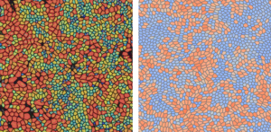
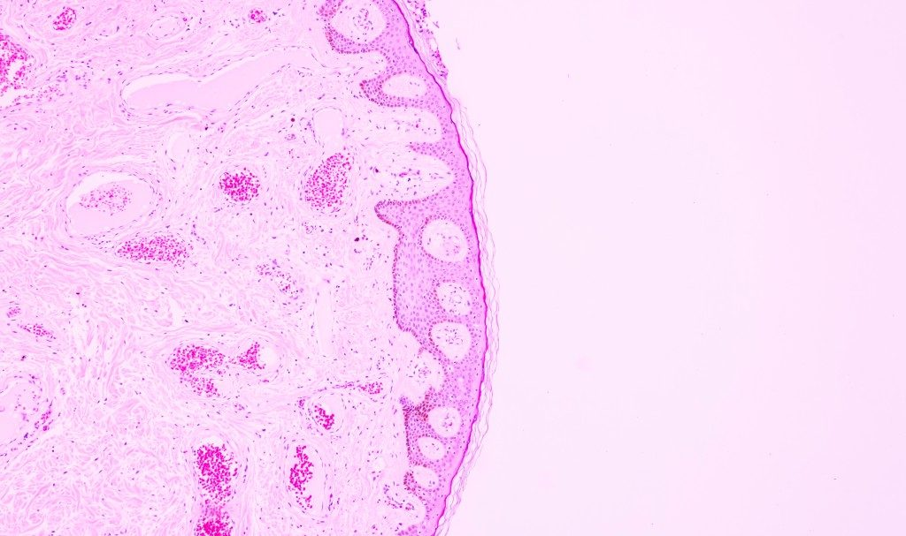

## About Me {#about}

I am an Integrated PhD student at the Indian Institute of Science, Bangalore, India.

## Research Interests {#research}

- **Biophysics**
- **Statistical Mechanics**
- **Condensed Matter Physics**

## Publications {#publications}

  <ol class="bibliography">
    <li>
      
Molecular communication in one-dimensional channels with active transport and crowding

      
<strong>Phanindra Dewan</strong> and Sumantra Sarkar

      
<em>Phys. Rev. E</em> 113 (5 May 2026), p. 054105

      

        <a class="btn" href="https://link.aps.org/doi/10.1103/mzhn-fc29" target="_blank">URL</a>
      

    </li>
    <li>
      
Symmetry-Protected Phases in a 1D Active Solid with Mechanochemical Feedback

      
Soumyadeep Mondal, <strong>Phanindra Dewan</strong>, Lakshman Santhosh Kumar, and Sumantra Sarkar

      
<em>Phys. Rev. Lett.</em> 137 (7 Aug. 2026), p. 078401

      

        <a class="btn" href="https://link.aps.org/doi/10.1103/p1bw-v87g" target="_blank">URL</a>
      

    </li>
    <li>
      
Heterotypic interfacial tension between oncogenic and wild-type populations forms the mechanical basis of tissue-specific oncogenesis in epithelia

      
Amrapali Datta, <strong>Phanindra Dewan</strong>, Aswin Anto Puthoor, Tanya Chhabra, Tanishq Tejaswi, Sindhu Muthukrishnan, Akshar Rao, Sumantra Sarkar, and Medhavi Vishwakarma

      
<em>eLife</em> 14 (Aug. 2026)

      

        <a class="btn" href="http://dx.doi.org/10.7554/eLife.106893.4" target="_blank">URL</a>
      

    </li>
    <li>
      
Glassy dynamics in active epithelia emerge from an interplay of mechanochemical feedback and crowding

      
Sindhu Muthukrishnan, <strong>Phanindra Dewan</strong>, Tanishq Tejaswi, Michelle B. Sebastian, Tanya Chhabra, Soumyadeep Mondal, Soumitra Kolya, Sumantra Sarkar, and Medhavi Vishwakarma

      
<em>Nature Communications</em> 17.1 (2026)

      

        <a class="btn" href="http://dx.doi.org/10.1038/s41467-026-74163-0" target="_blank">URL</a>
      

    </li>
  </ol>

## [Resources](https://phannyd.github.io/resources){: .btn} {#resources}

## In the news {#news}

  <ol class="bibliography">
    <li style="margin-bottom: 1.5rem;">
      
      
Unravelling the glass-like nature of epithelial tissues

      
Kritika Gaur

      
<em>IISc News</em> (July 2026)

      

        <a class="btn" href="https://www.iisc.ac.in/events/unravelling-the-glass-like-nature-of-epithelial-tissues/" target="_blank">URL</a>
      

    </li>
    <li style="margin-bottom: 1.5rem;">
      
      
How Lung and Breast Cells Fight Cancer Differently

      
Debdutta Paul

      
<em>Asian Scientist Magazine</em> (October 2025)

      

        <a class="btn" href="https://www.asianscientist.com/2025/10/health/how-lung-and-breast-cells-fight-cancer-differently/" target="_blank">URL</a>
      

    </li>
  </ol>

